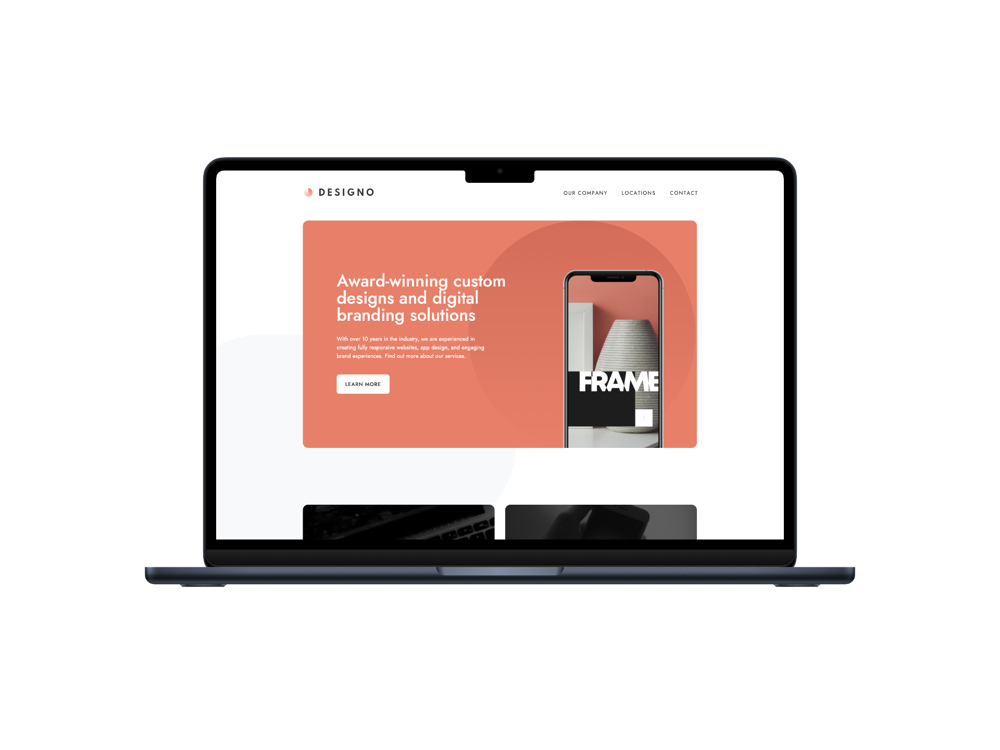

# Designo

A multi-page website designed for the fictional multinational company, Designo. The site is both accessible and responsive, providing users with detailed information about the company, its previous design projects, headquarters, and a convenient contact option to reach Designo.

## Contents

- [Mockups](#Mockups)
- [Features](#Features)
- [Installation](#Installation)
- [Usage](#Usage)
- [Contributing](#Contributing)

## Mockups

## Features

- Multi-Page navigation using `React-Router`.
- Resposive layout using **"mobile first"** development.
- Interactive "contact" form which collects users name, email, phone, and message, using Reacts `useState` hook to manage form data and validation errors.

## Installation

**1. Clone the repository:**: Begin by cloning this repository to your local machine using Git:

`git clone https://github.com/VCarames/React--Designo-FE.git`

**2. Install Dependencies**: Use npm to install the project dependencies:

`npm install`

**3. Start the Development Server**: To start the development server and preview your application, run the following command:

`npm run dev`

## Usage

**Page Navigation:**

1. Use the `header` `nav` menu to to navigate though the sites main pages; "Our Company","Locations" and "Contact".
2. To view the "Web", "App" and "Graphic" design pages, users can interact with their links in the "Home" page and be directed to their designated pages.

**Contact:**

1. (Located in the "Contact" page) Users can contact Designo by filling the form's required `input`fields and clicking the "submit" `button`.

## Contributing

Contributions to the Designo website **are welcome**! If you find any **issues** or would like to suggest **enhancements**, please submit a pull request.
